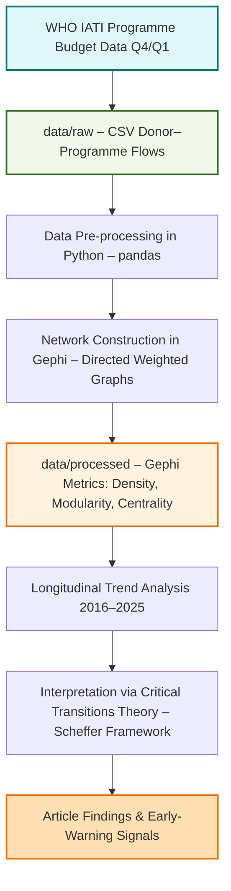

# PAPIIT Project – Critical Transitions in the Global Society and World Politics
**Network datasets and Gephi statistical outputs for the study:  
“Network Fragmentation and the 2025 Funding Shock: Early-Warning Signals of a Critical Transition in Global Health Governance”**

---

## Overview
This repository hosts the datasets and processed outputs used in the article:

> Ballesteros Pérez, C., & Santos Domínguez, A. B. (2025). *Network Fragmentation and the 2025 Funding Shock: Early-Warning Signals of a Critical Transition in Global Health Governance*. Submitted to McGill University’s [Journal of Global Health], as part of the PAPIIT IN303725 project *Critical Transitions in the Global Society and World Politics*, Faculty of Political and Social Sciences, UNAM.

The study applies **Critical Transitions Theory** (Scheffer, 2009) to a longitudinal social network analysis (SNA) of WHO’s financing and implementation network (2016–2025), detecting early‑warning signals of declining resilience in global health governance.

In keeping with the project’s commitment to **research transparency** and **data traceability**, this repository contains both raw and processed CSV files, along with methodological documentation to ensure reproducibility.

---

## Contents
- [Repository structure](#repository-structure)
- [Data description](#data-description)
- [Methodological framework](#methodological-framework)
- [Data workflow (Mermaid)](#data-workflow-mermaid)
- [Relevance to the study](#relevance-to-the-study)
- [How to use](#how-to-use)
- [Licence](#licence)
- [Contact](#contact)

---

## Repository Structure

data/
raw/ # Original WHO IATI datasets transformed into network edge/node CSVs
processed/ # Gephi outputs: network metrics (density, modularity, centrality, etc.)
docs/
methodology/ # Notes on data processing, analytical scripts, and workflow
references/ # Relevant literature and theoretical background
README.md # This document
---

## Data Description

### Raw data (`data/raw/`)
- **Format:** CSV (comma-separated values)  
- **Source:** WHO Programme Budget datasets from the International Aid Transparency Initiative (IATI) – Q4 datasets for 2016–2023, Q1 dataset for 2024–2025.  
- **Scope:** Donor–programme (country/region) funding flows, excluding WHO Headquarters allocations to avoid disproportionate centralisation effects.  
- **Use:** Construction of directed, weighted graphs representing WHO’s financing network per biennium.

### Processed data (`data/processed/`)
- **Format:** CSV  
- **Metrics generated in Gephi (v0.10.1):**
  - Degree, betweenness, and closeness centrality
  - Network density
  - Newman–Girvan modularity
  - Community assignments (Louvain algorithm, resolution = 0.8)  
- **Purpose:** Longitudinal assessment of network structure to detect early‑warning signals (autocorrelation, variance) of critical transitions.

---

## Methodological Framework
- **Theoretical basis:** Critical Transitions Theory (alternative stable states, basins of attraction, resilience, hysteresis).  
- **Analytical approach:** Social network analysis with a focus on density and modularity trends over time, interpreted through Scheffer’s early‑warning indicators:
  - **Temporal autocorrelation:** persistence of fragmentation patterns  
  - **Variance:** fluctuation magnitude in structural metrics
- **Tools:**
  - Data processing: Python 3.11.13 (`pandas`), Google Colab  
  - Network analysis & visualisation: Gephi v0.10.1

---

## Data Workflow (Mermaid)

